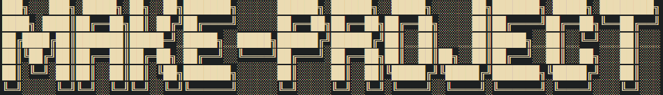

<!-- ███╗░░░███╗░█████╗░██╗░░██╗███████╗░░░░░░██████╗░██████╗░░█████╗░░░░░░██╗███████╗░█████╗░████████╗
████╗░████║██╔══██╗██║░██╔╝██╔════╝░░░░░░██╔══██╗██╔══██╗██╔══██╗░░░░░██║██╔════╝██╔══██╗╚══██╔══╝
██╔████╔██║███████║█████═╝░█████╗░░█████╗██████╔╝██████╔╝██║░░██║░░░░░██║█████╗░░██║░░╚═╝░░░██║░░░
██║╚██╔╝██║██╔══██║██╔═██╗░██╔══╝░░╚════╝██╔═══╝░██╔══██╗██║░░██║██╗░░██║██╔══╝░░██║░░██╗░░░██║░░░
██║░╚═╝░██║██║░░██║██║░╚██╗███████╗░░░░░░██║░░░░░██║░░██║╚█████╔╝╚█████╔╝███████╗╚█████╔╝░░░██║░░░
╚═╝░░░░░╚═╝╚═╝░░╚═╝╚═╝░░╚═╝╚══════╝░░░░░░╚═╝░░░░░╚═╝░░╚═╝░╚════╝░░╚════╝░╚══════╝░╚════╝░░░░╚═╝░░░ -->

# 1. Introduction

This is a simple cli-app that will help you to create a new project with a simple structure.

# make-project

A simple CLI tool to quickly scaffold React or Express projects with a predefined structure and dependencies.

## Project Types

### React Project

- Uses Vite as the build tool
- Includes Tailwind CSS for styling
- Sets up a basic project structure
- Configures Prettier for code formatting

### Express Project

- Sets up a basic API structure
- Includes common middleware (cors, morgan)
- Configures environment variables with dotenv
- Includes MongoDB connection setup with Mongoose

## Dependencies

  
React Project

  <ul>
    <li>React</li>
    <li>Vite</li>
    <li>Tailwind CSS</li>
    <li>Prettier</li>
  </ul>

  
Express Project

  <ul>
    <li>Express</li>
    <li>Morgan</li>
    <li>Dotenv</li>
    <li>CORS</li>
    <li>JSON Web Token</li>
    <li>Bcrypt.js</li>
    <li>Mongoose</li>
  </ul>

## Contributing

Contributions, issues, and feature requests are welcome! Feel free to check [issues page](https://github.com/utkarsh1311/make-project/issues).

## License

[MIT](https://choosealicense.com/licenses/mit/)

## Author

Your Name - [utkarsh1311](https://github.com/utkarsh1311)

---

Happy coding! 🎉
